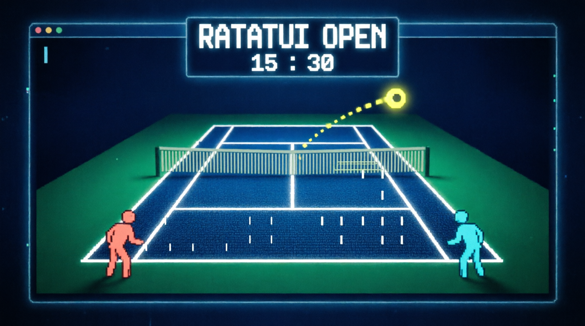

<p align="center">
  
</p>

<p align="center">
  <b>A 3D tennis match rendered entirely in unicode.</b><br>
  No GPU, no window manager, no mercy — just you, the CPU, and a<br>
  60&nbsp;fps centre court built from box‑drawing characters and a single perspective divide.
</p>

<p align="center">
  <code>🦀 rust 1.75+</code> &nbsp;·&nbsp;
  <code>🖥 ratatui 0.29</code> &nbsp;·&nbsp;
  <code>⌨ crossterm 0.28</code> &nbsp;·&nbsp;
  <code>🎾 plays in your terminal</code> &nbsp;·&nbsp;
  <code>⚖ MIT</code>
</p>

<p align="center">
  
  <br>
  <sub>recorded straight from the binary with <code>vhs demo.tape</code> · see <a href="#-record-your-own-highlight-reel">below</a></sub>
</p>

---

## 🎾 Serve it up

You don't install a game engine. You compile a tennis match.

```bash
git clone <this repo>
cd ratatui-open
cargo run --release          # best in a terminal ≥ 100×30